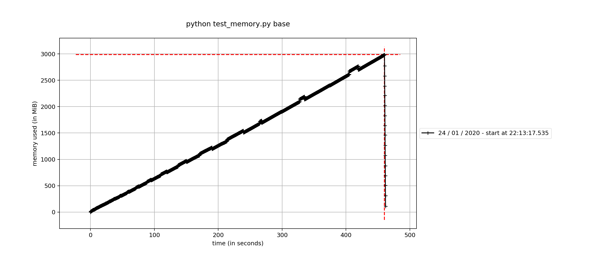
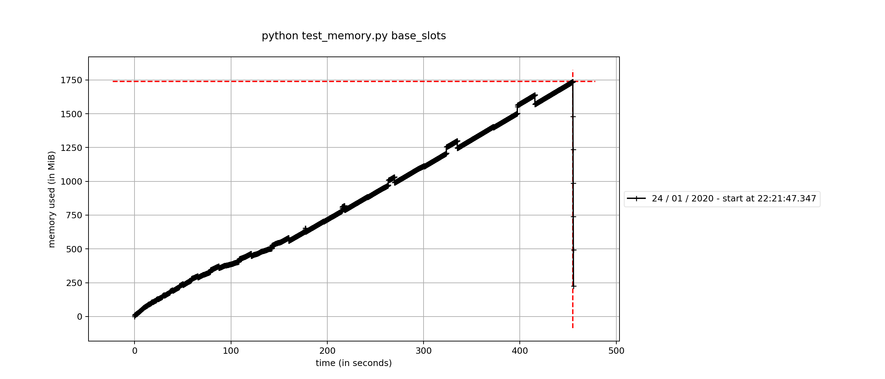
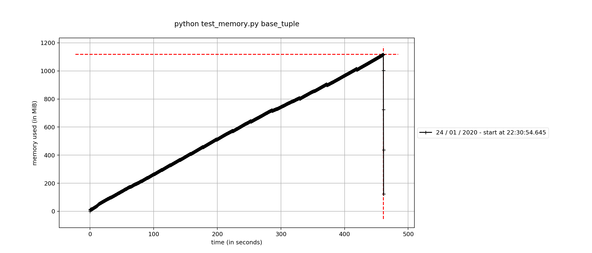
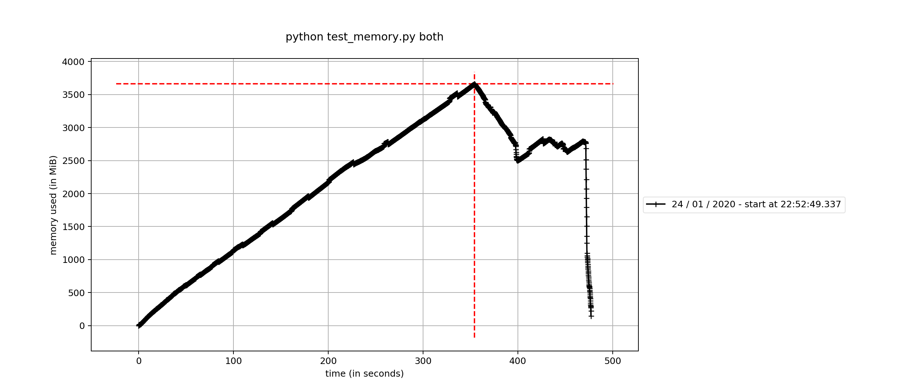
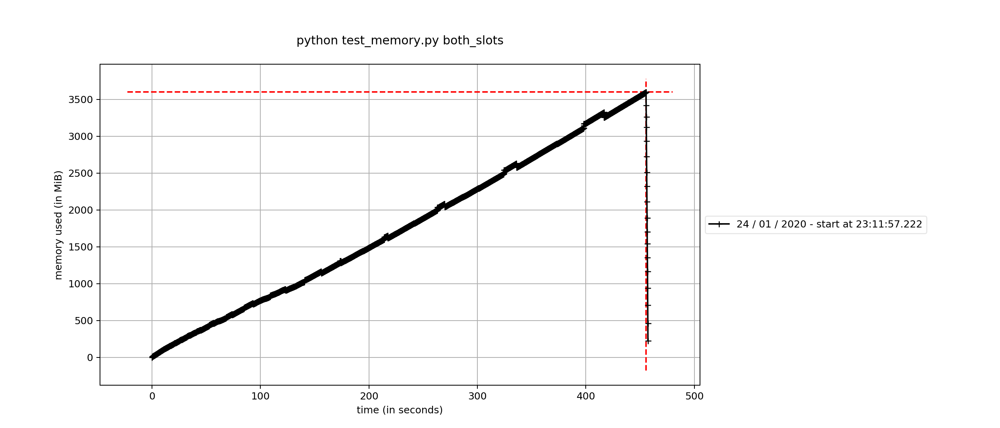
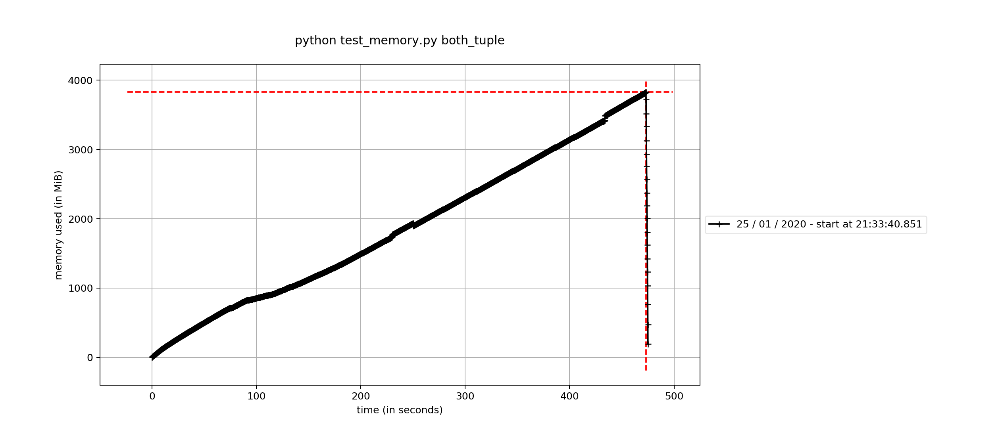

# Memory Usage of Various ManifestEntry Representations


```
REP=base
mprof run python test_memory.py $REP
mprof plot
mprof plot --flame
```

## `PackageEntryBase`
461secs to generate (primarily random string generation)


## `PackageEntrySlots`
455 secs



## `tuple_package_entry`
461 secs



## `PackageEntryWithPhysicalKey`
477


## `PackageEntryWithPhysicalKeySlots`
457


## `tuple_package_entry_with_physical_key`
474
